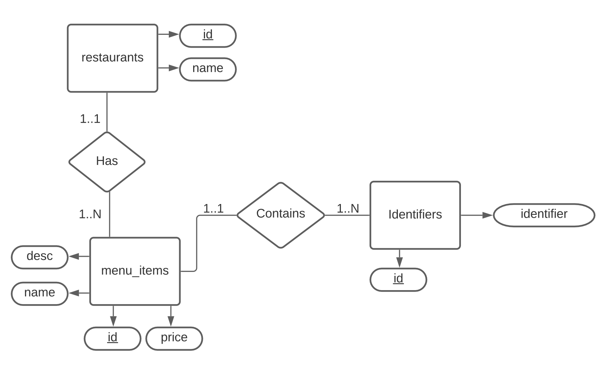

# Order Assistant

## **Introduction**
Drive-through ordering is an inherently complex process that is prone to confusion and error when relaying order information from customer to employee. Additionally, drive-through ordering is a highly unscalable process that requires one employee to take one order at a time instead of helping in-store customers. Order Assistant aims to remove the complexity and confusion from the drive-through ordering process. By using natural language processing, Order Assistant can increase order accuracy and remove the need to have a dedicated employee taking drive-through orders. 

## **Tech Stack**
| Component | Framework/Language |
|:-----------|:-----------|
| Frontend | React |
| Backend | Python FastAPI |
| Database Technology | GCP Postgres Instance |
| NLP & Text Processing | GCP API's | 

## **API Setup**
Order Assistant uses Python's Fast API. This selection allows us to quickly generate SwaggerUI pages for API endpoint testing. The API is quick and easy to set up if you have pipenv installed. 

```bash
cd api 
pipenv install 
pipenv shell
uvicorn main:app --reload
```

## **Active Endpoints**
1. ```POST /menu```
    - Creates menu object and stores in database instance.
2. ```POST /rest_database```
    - Clears database and loads it with starter menus (Dunkin Donuts and McDonalds)
3. ```GET /restaurant/<restaurant_id>```
    - Returns restaurant with given id, including name, and menu items (for displaying on the frontend)
4. ```GET /restaurant```
    - Returns restaurants available (just the names and ids)
<br />

## **Setup Documentation & Procedure**
<br />

### **Google Cloud Platform Connections**

Order Assistant uses 3 major GCP libaries/APIs.
1. Cloud SQL Admin API
2. Cloud Speech-to-text API
3. Cloud Natural Language API

The Cloud SQL Admin API allows us to create and access the Cloud SQL instance of Postgres. The Cloud Speech-to-text API is used to convert incoming MP3 files into parsable text on the server. Finally, the Cloud Natural Language API deconstructs the provided text into grammatical constructs which simplifies the process of converting this text into a restaurant order. 

### **Database Setup Information**

A locally hosted PostgresSQL instance is used as the main store of persistent data for this application. The following connection info can be included in a .env file to access your locally installed Postgres instance as the Postgres user:
```bash
DB_USER="postgres"
DB_PASS='postgres user passsword'
DB_NAME="orderassistant"
DB_HOST="localhost"
DB_PORT="5432"
```
The database contains 3 major tables: *restaurants*, *menu_itmes*, and *identifiers*. To load the default dataset onto a local Postgres instance query the '/reset_database' endpoint. An entity-relation diagram is included below.




